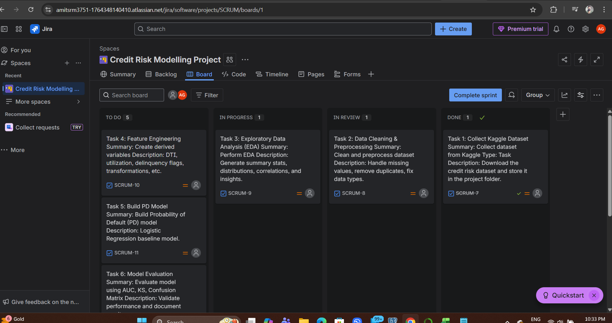
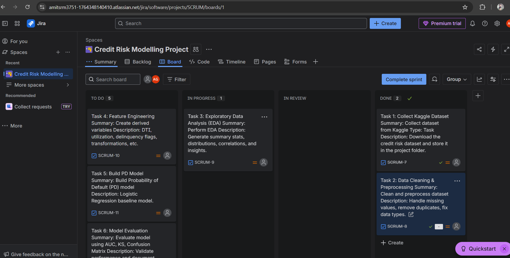

📘 Credit Risk Modelling Project

An end-to-end credit risk analytics project using Python, IFRS-9 ECL, and real-world banking workflows.

---
### 📂 What This Repository Contains
This repository showcases a complete Credit Risk Modelling pipeline, including:
- Data cleaning, preprocessing, and EDA
- PD (Probability of Default) modelling using Logistic Regression
- IFRS-9 Expected Credit Loss (ECL) framework implementation
- Documentation (BRD, FSD, User Stories)
- Agile workflow tracked through Jira

## 📊 Exploratory Data Analysis (EDA) Summary

The Exploratory Data Analysis phase focused on understanding borrower behavior, identifying risk patterns, validating data quality, and uncovering predictive relationships relevant to credit default (SeriousDlqin2yrs).

### 🔍 Key Insights

#### 1. Applicant Demographics
- **Age distribution is right-skewed**, with most borrowers between **30–60 years**.
- Very few borrowers are below 25 or above 75, reducing noise for age-based risk segmentation.

#### 2. Revolving Utilization (Credit Card Usage)
- Highly skewed with extreme outliers (values > 1.0).
- **Defaulters tend to show higher utilization**, indicating risk from maxed-out credit lines.

#### 3. Debt-to-Income Ratio (DTI)
- Extremely wide range with large outliers.
- Defaulters consistently exhibit **higher median DebtRatio**.

#### 4. Monthly Income
- Distribution is right-skewed with income outliers above ₹20 lakh (dataset equivalent).
- Default rates do **not decrease proportionally** with higher income — suggesting income alone is not a strong predictor.

---

### 🧱 Delinquency Pattern Analysis (Most Important EDA Insight)

We analyzed three delinquency buckets:

| Bucket | Meaning | Behavior |
|--------|---------|----------|
| **DPD 30–59** | Mild delinquency | Early warning indicator |
| **DPD 60–89** | Medium delinquency | Strong signal of financial stress |
| **DPD 90+** | Default proxy | Strongest predictor of SeriousDlqin2yrs |

#### 🔥 Findings
- All three delinquency variables are **skewed with most customers having 0 delinquency**.
- Strong positive correlations:
  - **DPD 60–89 ↔ DPD 90+** (0.66)
  - **DPD 30–59 ↔ DPD 60–89** (0.56)
- Customers with repeated 30–59 day delinquencies often progress to 60–89 and then 90+ status.

#### IFRS-9 Interpretation
- **Performing Loans (Stage 1):** No delinquencies → 12-month ECL  
- **SICR (Stage 2):** Repeated 30–59 or 60–89 delinquencies → Lifetime ECL  
- **Default (Stage 3):** 90+ DPD → Lifetime ECL + interest reversal  

These delinquency patterns directly support IFRS-9 staging logic in later modeling steps.

---

### 🗂️ Outlier & Correlation Analysis
- Outliers present in **Revolving Utilization**, **DebtRatio**, and **MonthlyIncome**.
- Correlation heatmap confirms:
  - Delinquency buckets are strong predictors of default.
  - Other features show weak to moderate correlations.

---

### ✅ EDA Outcome
The dataset is:
- Cleaned  
- Validated  
- Understood statistically  
- Ready for **Feature Engineering** and **PD Model Development**

---
### 🔗 Quick Navigation
- [EDA Summary](#-exploratory-data-analysis-eda-summary)
- [Project Overview](#1-project-overview)
- [Tech Stack](#2-tech-stack)
- [Project Structure](#3-project-structure)
- [Documentation](#4-documentation)
- [Agile Workflow](#5-agile-workflow-enhanced-jira-section)
- [Modelling Steps](#6-modelling-steps)
- [Future Enhancements](#7-future-enhancements)
- [About the Author](#8-about-the-author)
- [Target Roles](#9-target-roles)
- [Project Status](#10-project-status)

📌 1. Project Overview

This project demonstrates the complete lifecycle of a Credit Risk Modelling project used in banks and NBFCs. It includes:

- Data Collection (Kaggle Dataset)
- Data Cleaning & Preprocessing
- Exploratory Data Analysis (EDA)
- Feature Engineering
- PD (Probability of Default) Model
- Model Evaluation (AUC, KS, Confusion Matrix)
- IFRS-9 Expected Credit Loss (ECL) Calculation
- Documentation (User Stories, BRD, FSD)
- Jira-based Agile Workflow

The goal is to build a transparent, auditable, and end-to-end risk analytics framework.

---

⚙️ 2. Tech Stack

- Python (pandas, numpy, scikit-learn, matplotlib)
- Jupyter Notebook
- SQL (for portfolio-style queries)
- IFRS-9 Framework (PD × LGD × EAD)
- Jira (Scrum workflow)
- GitHub (Version control & documentation)

---

📂 **3. Project Structure**

credit-risk-models/
│
├── data/
│ ├── raw/
│ └── processed/
│ ├── credit_data_cleaned.csv
│ └── credit_data_cleaned_final.csv
│
├── notebooks/
│ ├── 01_data_cleaning.ipynb
│ ├── 02_eda.ipynb
│ ├── 03_pd_model.ipynb
│ └── 04_ecl_calculation.ipynb
│
├── docs/
│ ├── User_Stories.md
│ ├── BRD.md
│ └── FSD.md
│
├── jira_screenshots/
│ ├── jira_board_progress_1.png
│ ├── Jira_Board_Progress_2.png
│
├── ifrs9_ecl/
├── pd_model/
├── lgd_ead_models/
└── README.md

---

📜 4. Documentation

🔹 **User Stories**  
Defines functional expectations and user needs.  
👉 `/docs/User_Stories.md`

🔹 **Business Requirements Document (BRD)**  
Explains business goals, scope, and credit risk objectives.  
👉 `/docs/BRD.md`

🔹 **Functional Specification Document (FSD)**  
Technical workflow and model specifications.  
👉 `/docs/FSD.md`

---

🚀 5. Agile Workflow (Enhanced Jira Section)

This project follows a structured **Scrum/Kanban hybrid Agile workflow**, tracked in Jira.

## 🧭 Project Management Approach

I managed this project using **Jira Scrum Board**, including:

- Epics for each major workstream  
- User stories aligned with credit risk modelling  
- Technical tasks under each story  
- Tracking progress through Backlog → In Progress → In Review → Done  
- Daily updates and weekly sprint planning  

---

## 🧩 Jira Structure

### **Epics**
- Data Understanding & Requirement Gathering  
- Data Cleaning & Transformation  
- EDA & Feature Engineering  
- PD Model Development  
- LGD Model Development (future)  
- EAD Model Development (future)  
- Documentation & Reporting  

---

## 📝 Sample User Stories

### **US-01: Dataset Understanding**  
*As a Credit Risk Analyst, I want to understand the dataset so that I can plan the modeling steps.*

**Tasks:**  
- Import raw datasets  
- Data dictionary creation  
- Missing value and outlier identification  

---

### **US-02: Data Cleaning**  
*As a Model Developer, I want to clean and preprocess the dataset so that it becomes modeling-ready.*

**Tasks:**  
- Missing value treatment  
- Outlier capping  
- Data type corrections  
- Feature formatting  

---

### **US-03: PD Model Development**  
*As a Risk Modeler, I want to build a PD model so that I can assess borrower default probability.*

**Tasks:**  
- Train/test split  
- Logistic Regression baseline  
- ROC, AUC, KS evaluation  

---

## 🏃 Sprint Overview

### **Sprint 1**  
- Requirement analysis  
- Dataset exploration  
- Initial data cleaning  
- Jira board setup  

### **Sprint 2**  
- EDA  
- Feature engineering  
- PD model baseline development  

### **Sprint 3**  
- LGD/EAD modelling (future phase)  
- Model validation  

### **Sprint 4**  
- Documentation  
- Repo structuring  
- Cleanup and versioning  

---

## 📸 Jira Progress Screenshots

Actual Jira board screenshots from this project:

### **1️⃣ Board Progress – Screenshot 1**  

### **2️⃣ Board Progress – Screenshot 2**  

---

🔬 6. Modelling Steps

**Step 1 — Data Cleaning**
- Handle missing values  
- Remove duplicates  
- Fix data types  
- Treat outliers  

**Step 2 — EDA**
- Statistical summary  
- Risk indicator exploration  
- Correlation heatmap  
- Target variable patterns  

**Step 3 — Feature Engineering**
- DTI  
- Utilization rate  
- Delinquency flags  
- Credit behaviour metrics  

**Step 4 — PD Model**
- Logistic Regression baseline  
- PD scoring & risk bands  
- Threshold tuning  

**Step 5 — Model Evaluation**
- AUC  
- KS Statistic  
- Confusion Matrix  
- Precision/Recall  

**Step 6 — IFRS-9 ECL Calculation**
- Stage 1 / Stage 2 / Stage 3 logic  
- Lifetime PD (future enhancement)  
- ECL = PD × LGD × EAD  

---

🛠️ 7. Future Enhancements

- XGBoost & Random Forest PD models  
- LGD and EAD modelling  
- Power BI dashboard  
- SQL-driven portfolio analytics  
- Streamlit model deployment  

---

👤 8. About the Author

**Amitabh Gogoi**  
Senior Manager – Credit Risk • Business Analyst • IFRS-9 ECL • Portfolio Analytics  
11+ years of professional experience in banking risk.

---

⭐ 9. Target Roles

- Credit Risk Modelling  
- Risk Analytics  
- IFRS-9 Model Validation  
- Data Analyst (Banking)  
- Business Analyst – Risk  

---

📌 10. Project Status

> 📝 **Status:** EDA Completed | PD Model Development In Progress  
> 📅 Last Updated: December 2025  

